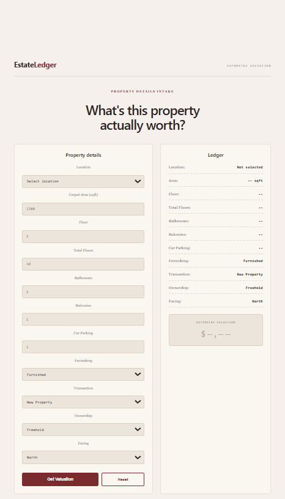
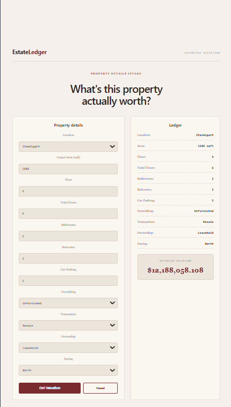
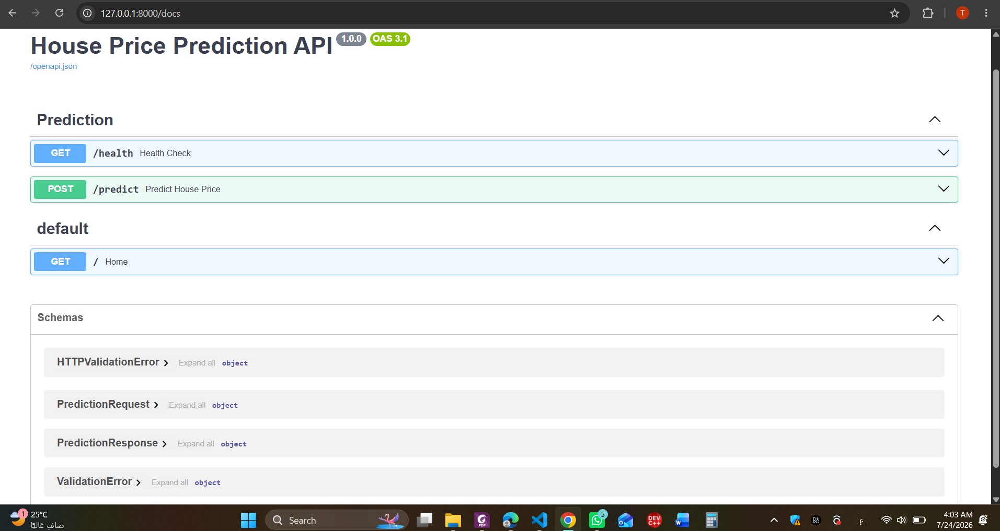

# 🏠 House Price Prediction







A full-stack Machine Learning web application that predicts house prices using a trained **Random Forest Regressor**. The project combines a **FastAPI** backend with a **React + Vite** frontend, allowing users to estimate property prices through an interactive web interface.

---

## 🚀 Features

- 🏡 Predict house prices instantly
- ⚡ FastAPI REST API
- 💻 React + Vite frontend
- 🌲 Random Forest Machine Learning model
- 📊 Interactive property valuation interface
- 🔄 Real-time prediction results

---

## 🔗 GitHub Repository

https://github.com/mennarashedd/House-Price-Prediction

---

## 👥 Team

- **Tasneem Saeed Mohammed**
- **Menna Elsayed**
- **Menna Rashed**

---

## 📁 Project Structure

```text
House-Price-Prediction/
│
├── backend/
│   ├── app/
│   │   ├── api/
│   │   │   ├── routes/
│   │   │   │   └── prediction.py
│   │   │   └── core/
│   │   ├── schemas/
│   │   │   └── prediction.py
│   │   ├── services/
│   │   │   ├── inference.py
│   │   │   └── preprocessing.py
│   │   └── main.py
│   ├── models/
│   │   └── house_price.pkl
│   └── requirements.txt
│
├── frontend/
│   ├── src/
│   ├── public/
│   ├── package.json
│   └── vite.config.ts
│
├── screenshots/
│   ├── home.png
│   ├── prediction.png
│   └── swagger.png
│
└── house-price-prediction-project.ipynb
```

---

## 🧱 System Architecture

```text
User
   │
   ▼
EstateLedger Frontend
   │
POST /predict
   │
   ▼
FastAPI Backend
   │
prepare_features()
   │
   ▼
Random Forest Model (.pkl)
   │
predicted_price
   ▼
Frontend UI
```

---

## 🛠️ Tech Stack

| Layer | Technology |
|-------|------------|
| Frontend | React, Vite, TypeScript, CSS |
| Backend | Python, FastAPI, Uvicorn, Pydantic |
| Machine Learning | Pandas, NumPy, Scikit-learn, Joblib |
| Notebook | Jupyter Notebook |
| Dataset | Kaggle House Price Dataset |
| Version Control | Git, GitHub |

---

## 📊 Dataset

- **Source:** Kaggle House Price Dataset
- **Notebook Path:**

```text
/kaggle/input/datasets/juhibhojani/house-price/house_prices.csv
```

---

## 🧹 Data Preparation

The dataset was preprocessed before training by applying:

- Handling missing values
- Removing duplicate records
- Outlier treatment using the IQR method
- Encoding categorical variables
- Feature engineering
- Feature selection
- Data normalization where required

---

# 📈 Model Performance

Two models were trained and compared:

| Model | MAE | RMSE | R² Score |
|------|---------:|-----------:|---------:|
| Linear Regression | 7,763,232 | 512,592,500 | -1861.13 |
| **Random Forest Regressor** | **1,594,929** | **4,847,097** | **0.8335** |

✅ **Random Forest Regressor** achieved the best performance with an **R² Score of 0.8335**, explaining approximately **83%** of the variance in house prices.

The model was trained on a log-transformed target. At inference time, the backend reverses the logarithmic transformation using `np.expm1()` when needed before returning the predicted value.

The trained model is serialized using **Joblib** and stored in:

```text
backend/models/house_price.pkl
```

---

# ⚙️ Installation

## Prerequisites

- Python 3.9+
- Node.js 18+

### Clone the Repository

```bash
git clone https://github.com/Tasneem-saeed-mohamed/House-Price-Prediction.git
cd House-Price-Prediction
```

### Backend

```bash
cd backend
pip install -r requirements.txt
uvicorn app.main:app --reload
```

Backend:

```
http://127.0.0.1:8000
```

Swagger Docs:

```
http://127.0.0.1:8000/docs
```

### Frontend

```bash
cd frontend
npm install
npm run dev
```

Frontend:

```
http://localhost:5173
```

---

# 📡 API Reference

### GET /health

Health check endpoint.

**Response**

```json
{
  "status": "ok"
}
```

---

### POST /predict

Returns an estimated house price.

Base URL:

```
http://127.0.0.1:8000
```

### Request Body

| Field | Type | Example | Notes |
|------|------|---------|------|
| location | string | Chandigarh | City name |
| carpet_area_sqft | float | 1686 | Carpet area (sqft) |
| floor_num | integer | 4 | Floor number |
| total_floors | integer | 6 | Default = 5 |
| bathroom | integer | 2 | Number of bathrooms |
| balcony | integer | 2 | Number of balconies |
| car_parking | integer | 5 | Default = 1 |
| furnishing | string | Unfurnished | Furnished / Unfurnished |
| transaction | string | Resale | New Property / Resale |
| ownership | string | Leasehold | Freehold / Leasehold |
| facing | string | North | Property facing |

### Example Request

```bash
curl -X POST http://127.0.0.1:8000/predict \
-H "Content-Type: application/json" \
-d '{
  "location": "Chandigarh",
  "carpet_area_sqft": 1686,
  "floor_num": 4,
  "total_floors": 6,
  "bathroom": 2,
  "balcony": 2,
  "car_parking": 5,
  "furnishing": "Unfurnished",
  "transaction": "Resale",
  "ownership": "Leasehold",
  "facing": "North"
}'
```

### Response Model

```python
class PredictionResponse(BaseModel):
    predicted_price: float
```

### Example Response

```json
{
  "predicted_price": 12188058.108
}
```

### Error Responses

| Status | Description |
|---------|-------------|
| 200 | Prediction generated successfully |
| 400 | Invalid prediction request or preprocessing/model error |
| 422 | Validation error |
| 500 | Model failed to load |

---

## 🔄 Prediction Pipeline

1. User enters the property information.
2. The frontend sends a POST request to `/predict`.
3. FastAPI validates the request using `PredictionRequest`.
4. `prepare_features()` converts the request into a Pandas DataFrame.
5. The trained Random Forest model predicts the property price.
6. The backend returns the prediction as JSON.
7. The frontend displays the estimated valuation.

---

## 🖼️ Screenshots

### 🏠 Home Page


---

### 💰 Prediction Result


---

### 📡 Swagger API Documentation


---

## 📈 Future Improvements

- Hyperparameter tuning
- XGBoost and Gradient Boosting comparison
- More location-based features
- Docker support
- Cloud deployment

---

## 📄 License

This project is intended for educational purposes as part of the **ITI Artificial Intelligence & Machine Learning Program**.

---

## ⭐ Acknowledgment

Special thanks to the **Information Technology Institute (ITI)** for providing the learning environment and project guidance.
